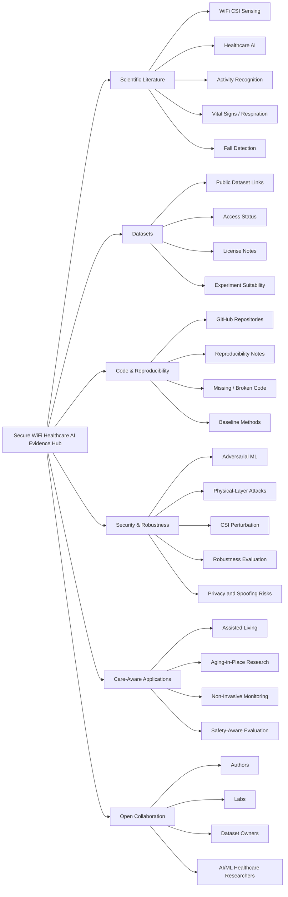
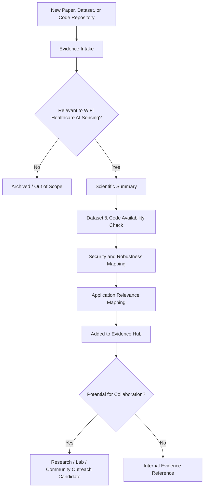

# Secure WiFi Healthcare AI Evidence Hub

  <strong>An open research mapping initiative for secure, trustworthy, and reproducible WiFi CSI-based healthcare AI sensing.</strong>

  
  
  
  

---

## Overview

The **Secure WiFi Healthcare AI Evidence Hub** is a curated research initiative focused on organizing scientific evidence around **WiFi CSI-based healthcare AI sensing**.

The project maps papers, datasets, code releases, reproducibility notes, security relevance, and open research gaps for contactless sensing systems that may support future care-aware environments such as assisted living, aging-in-place research, and non-invasive activity or vital-sign monitoring studies.

The goal is to make the research landscape easier to understand, compare, reproduce, and extend.

---

## Research Motivation

WiFi sensing has shown promise for contactless monitoring tasks such as activity recognition, fall detection, respiration estimation, and other healthcare-relevant sensing problems. However, many systems are evaluated mainly under normal operating conditions.

For future AI-enabled sensing in care-aware environments, the field needs stronger evidence around:

- Dataset availability and limitations
- Code availability and reproducibility
- Robustness under noise, domain shift, and adversarial conditions
- Security risks at the wireless physical layer
- Clear mapping between sensing failures and real-world care scenarios
- Open research gaps that require collaboration across AI/ML, wireless sensing, cybersecurity, and healthcare technology

This hub is designed to organize that evidence in a structured, transparent, and collaboration-friendly way.

---

## Project Direction

| Direction | Purpose |
|---|---|
| Scientific Evidence Mapping | Curate and classify papers, datasets, methods, and open gaps in WiFi CSI-based healthcare AI sensing |
| Trustworthy AI/ML Sensing | Track robustness, reproducibility, and model-evaluation limitations across existing work |
| Wireless Security Analysis | Identify adversarial, physical-layer, spoofing, perturbation, and privacy-related risks |
| Care-Aware Applications | Connect technical research to assisted living, aging-in-place, contactless monitoring, and healthcare-relevant environments |
| Open Collaboration | Create a structured place for researchers, labs, and practitioners to suggest related work, datasets, and code |

---

## Visual Research Scope

---

## Evidence Workflow

---

## Evidence Categories

| Category | Purpose |
|---|---|
| Core Research Evidence | Papers that strongly shape the technical direction of secure WiFi healthcare sensing |
| Healthcare WiFi Sensing | Work on contactless sensing for activity, fall detection, respiration, vital signs, and related tasks |
| Security and Robustness Evidence | Papers on adversarial attacks, defenses, spoofing, perturbation, privacy, and physical-layer risks |
| Dataset Evidence | Public datasets, access status, licensing, modalities, endpoints, and suitability for experiments |
| Code and Reproducibility Evidence | Available repositories, reproducibility notes, baseline implementations, and missing-code gaps |
| Care-Aware Application Evidence | Research connected to assisted living, aging-in-place, remote monitoring, and safety-aware sensing |
| Collaboration Leads | Authors, labs, datasets, and groups whose work may connect to this evidence hub |

---

## Intended Audience

This project is designed for researchers and practitioners working across:

- AI/ML for healthcare sensing
- WiFi CSI and wireless sensing
- Cybersecurity and adversarial machine learning
- Reproducible research
- Aging technology and assisted-living research
- Contactless monitoring systems
- Trustworthy AI in care-aware environments

---

## Collaboration Invitation

Suggestions are welcome for:

- Relevant papers
- Public datasets
- Code repositories
- Reproducibility notes
- Missing but important related work
- Security or robustness gaps
- Research groups or labs working in related areas

Future GitHub issue templates will provide a structured way to suggest papers, datasets, and code resources.

---

## Research Disclaimer

This project is a research evidence hub. It does **not** claim clinical validation, medical-device readiness, real patient deployment, regulatory approval, or diagnostic capability.

The focus is scientific evidence mapping, reproducibility, security analysis, and trustworthy AI/ML sensing methods for healthcare-relevant and care-aware research environments.

---

## Current Status

This evidence hub is under active development as a structured research resource for secure WiFi CSI-based healthcare AI sensing.
