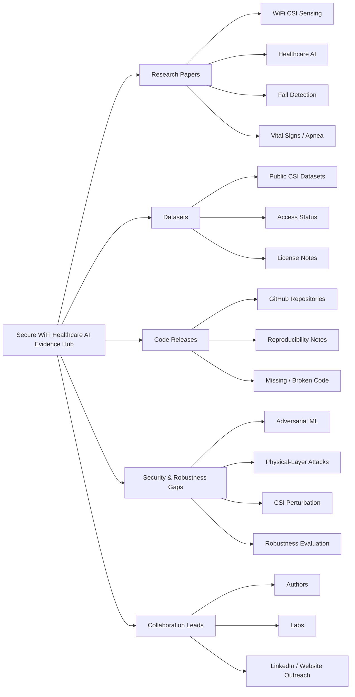
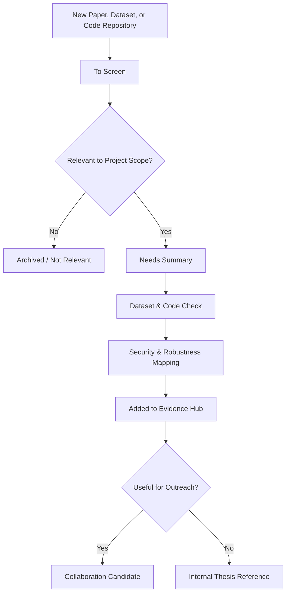

# Secure WiFi Healthcare AI Evidence Hub

  <strong>Curated research evidence for secure, trustworthy, and reproducible WiFi CSI-based healthcare AI sensing.</strong>

  
  
  
  

---

## Overview

The **Secure WiFi Healthcare AI Evidence Hub** is a curated research project for organizing papers, datasets, code releases, reproducibility notes, security relevance, and open research gaps in **WiFi CSI-based healthcare AI sensing**.

This project supports three connected goals:

| Goal | How this hub supports it |
|---|---|
| PhD thesis support | Maps key papers, datasets, attack models, defense methods, and research gaps |
| Technical portfolio | Demonstrates AI/ML, wireless sensing, cybersecurity, and reproducible research skills |
| Startup and collaboration | Creates a public-facing hub for researchers, labs, and healthcare-AI collaborators |

---

## Visual Research Scope

---

## Evidence Workflow

---

## Evidence Categories

| Category | Purpose |
|---|---|
| Core Thesis Evidence | Papers directly supporting the PhD research direction |
| Healthcare WiFi Sensing | Work on fall detection, vital signs, apnea, activity, and contactless monitoring |
| Security and Robustness Evidence | Papers on adversarial attacks, defenses, spoofing, perturbation, and robustness |
| Dataset Evidence | Public datasets, access status, licensing, and suitability for experiments |
| Code and Reproducibility Evidence | Available repositories, reproducibility notes, missing code, and implementation gaps |
| Collaboration Leads | Authors, labs, and groups whose work may connect to this project |

---

## Current Status

This evidence hub is under active development as part of a broader PhD research direction on **secure WiFi CSI-based healthcare sensing**.

---

## Research Disclaimer

This project is a research evidence hub. It does **not** claim clinical validation, medical-device readiness, real patient deployment, regulatory approval, or diagnostic capability. The focus is academic research organization, reproducibility, security analysis, and trustworthy AI/ML sensing methods.
