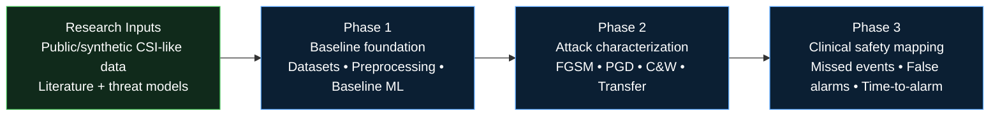
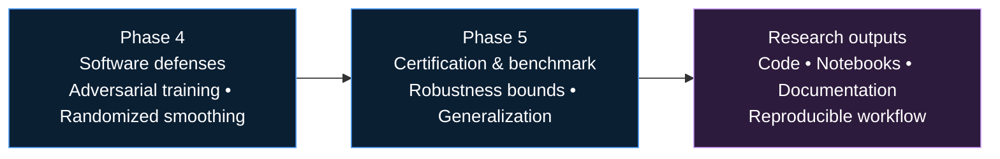

# Secure WiFi CSI Healthcare Sensing — Thesis Research Roadmap

**Disclaimer:** This is a research roadmap for a PhD prototype. It does not claim clinical validation, real patient data use, medical-device readiness, or deployment in clinical care.

## Short project purpose

Provide a structured, reproducible research plan to investigate adversarial risks and robustness for WiFi Channel State Information (CSI) sensing applied to healthcare monitoring, including falls, apnea, and activity-related sensing scenarios. The goal is a PhD-quality prototype, reproducible benchmark workflow, and technical contributions in attack characterization, robustness methods, and safety-oriented evaluation metrics.

---

## Visual roadmap

### Research pipeline: sensing, attacks, and safety mapping

### Hardening, certification, and research outputs

---

## Phase-to-thesis-chapter mapping

| Phase | Tentative thesis chapter | Core deliverables |
|---|---:|---|
| Phase 1 — Baseline and experimental foundation | Chapter 3: Experimental setup and baselines | Public dataset list, preprocessing code, baseline model implementations, clean metrics |
| Phase 2 — Attack surface characterization | Chapter 4: Attack taxonomies and white-/black-box evaluation | Attack implementations such as FGSM, PGD, C&W-style attacks, transfer experiments, and physical-layer framing notes |
| Phase 3 — Clinical safety metric mapping | Chapter 5: Safety-oriented evaluation | Defined clinical-style metrics such as missed events/day, false alarms/hour, time-to-alarm delay, and mapping from model errors to safety impact |
| Phase 4 — Software-only defenses | Chapter 6: Robustness methods | Adversarial training experiments, randomized smoothing evaluations, and clean-vs-robust trade-off analysis |
| Phase 5 — Certification, generalization, and benchmark | Chapter 7: Certification and reproducible benchmark | Certified bounds where possible, cross-room/cross-dataset generalization studies, and planned benchmark artifacts |

---

## Workstream table for GitHub Projects, Issues, and Milestones

| Workstream | Project board column | Typical tasks | Relevant expertise |
|---|---|---|---|
| Data and preprocessing | Backlog / Data | Dataset curation, preprocessing pipelines, synthetic CSI scripts | Researcher / data engineering |
| Baselines and experiments | In progress | Model training, evaluation, clean metrics | Machine learning / signal processing |
| Attacks and threat models | In progress | Implement FGSM, PGD, C&W-style, transfer attacks, and physical-layer framing | Wireless security / adversarial ML |
| Safety metrics and mapping | Review | Define event-level metrics and simulate safety-oriented rates | Clinical-safety perspective / research evaluation |
| Defenses and certification | Validation | Adversarial training, smoothing, and certification attempts | Robust ML / security research |
| Benchmark release and documentation | Release | Packaging, reproducibility scripts, license notes, dataset notes | Research maintainer / documentation |

---

## Research outputs expected from each phase

- **Phase 1:** Reproducible dataset inventory, preprocessing library, baseline model suite, and benchmark scripts.
- **Phase 2:** A taxonomy of attack surfaces for CSI sensing, reproducible attack implementations, white-box and transfer attack results, and no clinical claims.
- **Phase 3:** Operationalized safety-oriented evaluation metrics and mapping methodology translating model errors into event-level rates.
- **Phase 4:** Defense evaluations showing empirical robustness and clean-vs-robust tradeoffs, with code to reproduce results.
- **Phase 5:** Certified-robustness analysis where applicable, cross-domain generalization study, and planned reproducible benchmark artifacts.

---

## How this roadmap supports thesis, job hunting, and future collaboration goals

- **Thesis:** Provides clear chapter structure, reproducible experiments, and a path toward theoretical and empirical contributions.
- **Job hunting / recruiters:** Demonstrates expertise in ML robustness, wireless sensing, signal processing, healthcare cybersecurity, and safety-aware evaluation.
- **Future research collaboration:** Produces reproducible prototype code, planned benchmark artifacts, and documented threat models suitable for research partnerships or technology-transfer discussions as a non-clinical prototype.

---

## Links to related repo folders

- [notebooks](../notebooks/)
- [docs](../docs/)
- [datasets](../datasets/)
- [literature](../literature/)
- [results](../results/)

---

## Placeholder links to future files in this folder

- [literature_map.md](literature_map.md)
- [dataset_tracking.md](dataset_tracking.md)
- [experiment_tracker.md](experiment_tracker.md)
- [research_to_prototype.md](research_to_prototype.md)

---

## Notes and constraints

- This roadmap is explicitly experimental and research-oriented.
- It does not claim clinical validation, medical-device readiness, or deployment in clinical care.
- All datasets used must be public, synthetic, or properly authorized.
- Ethical data-use policies, licensing, and reproducibility practices should be followed.

---

_Last updated: 2026-05-25_
